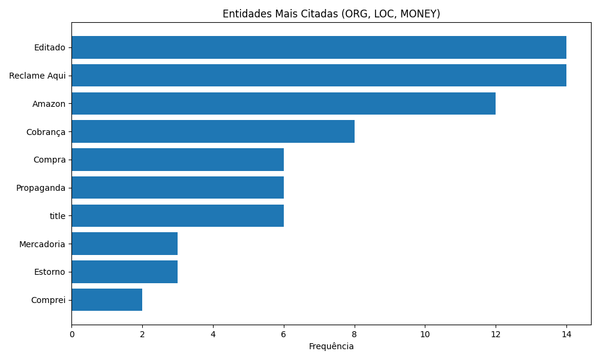

# Projeto NER: Extração de Entidades Nomeadas em Reclamações

Este projeto aplica técnicas de Processamento de Linguagem Natural (NLP) para extrair automaticamente entidades importantes (como empresas, locais e valores) em textos reais de reclamações extraídas do site Reclame Aqui.

## Em outras palavras

A ideia aqui é ensinar a máquina a identificar nomes de empresas, lugares e valores dentro de reclamações de consumidores. Isso ajuda a transformar o texto livre em dados organizados, que podem ser usados para entender padrões de problemas e identificar marcas mais citadas.

## Como o projeto foi executado

- Foi utilizado um modelo pré-treinado da biblioteca `spaCy`, chamado `pt_core_news_sm`, treinado para reconhecer entidades em português.
- As reclamações foram processadas linha por linha, e entidades dos tipos `ORG` (organizações), `LOC` (localizações) e `MONEY` (valores) foram extraídas.
- As entidades mais citadas foram agrupadas e visualizadas em um gráfico de barras.

## Tecnologias utilizadas

- Python
- pandas
- spaCy
- matplotlib
- collections (Counter)

## Resultado

O projeto gerou uma visualização das 10 entidades mais mencionadas entre centenas de reclamações. Essas entidades ajudam a entender quais marcas, cidades e valores aparecem com mais frequência nos relatos dos consumidores.

## Visualização

- Gráfico de entidades mais frequentes:
  

