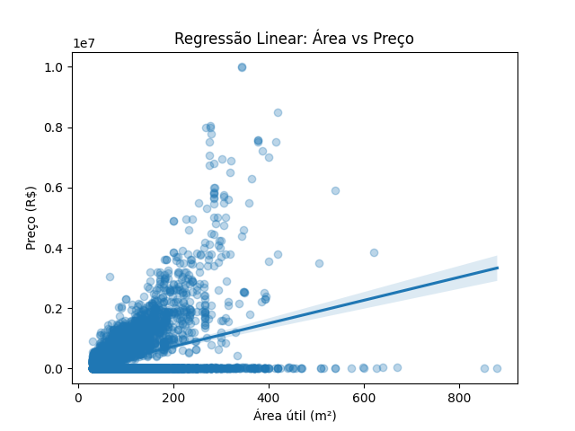

# Análise de Regressão: Fatores que Influenciam o Preço de Imóveis em São Paulo

Este projeto tem como objetivo analisar quais características mais influenciam o preço de imóveis em São Paulo, utilizando regressão linear simples e múltipla com dados reais.

## Dataset

- Fonte: [Kaggle - São Paulo Real Estate - April 2019](https://www.kaggle.com/datasets/argonalyst/sao-paulo-real-estate-sale-rent-april-2019)
- Registros: 13.640 imóveis
- Variáveis principais: área útil (Size), número de quartos (Rooms), banheiros (Toilets), suítes (Suites) e vagas (Parking)

## Objetivo

Investigar a relação entre atributos do imóvel e seu preço, utilizando:
- Regressão Linear Simples (área vs. preço)
- Regressão Linear Múltipla (com múltiplos atributos)

## Tecnologias

- Python
- Pandas
- Statsmodels
- Seaborn e Matplotlib
- Jupyter Notebook

## Resultados

- A área do imóvel (Size) tem influência positiva no preço (R$ 3.826,36 por m², regressão simples)
- A regressão múltipla melhorou a explicação do modelo (R² passou de 0.143 para 0.160)
- Variáveis mais relevantes: `Size`, `Toilets` e `Parking`
- `Rooms` mostrou-se irrelevante estatisticamente (p > 0.95)

## Visualizações

- 
- 

## Conclusão

A análise mostra que o tamanho, número de banheiros e vagas de garagem são fatores relevantes na precificação de imóveis. Quartos e suítes podem estar correlacionados com outras variáveis e exigem uma análise mais cuidadosa.

## Arquivos

- `regressao-imoveis.ipynb`: notebook com toda a análise
- `dados/imoveis_sp.csv`: dados utilizados
- `imagens/`: gráficos gerados

---
